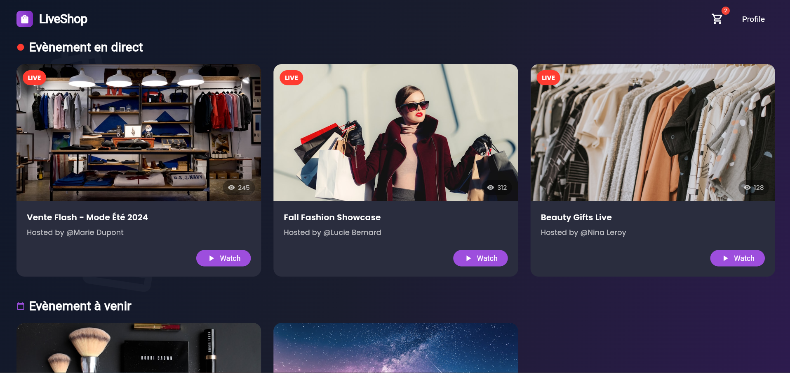
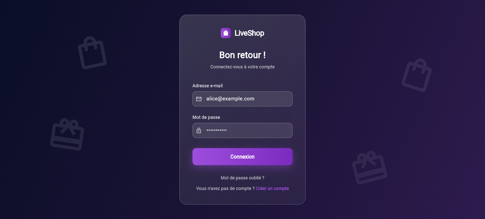
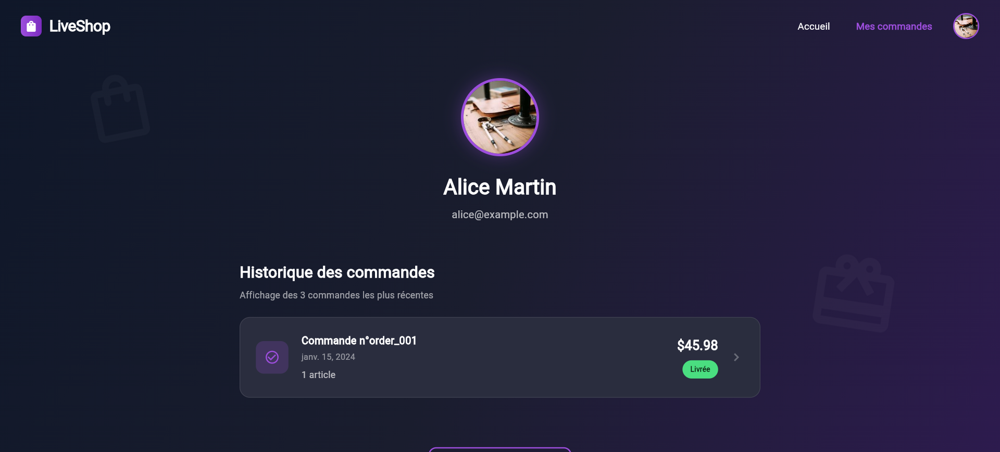
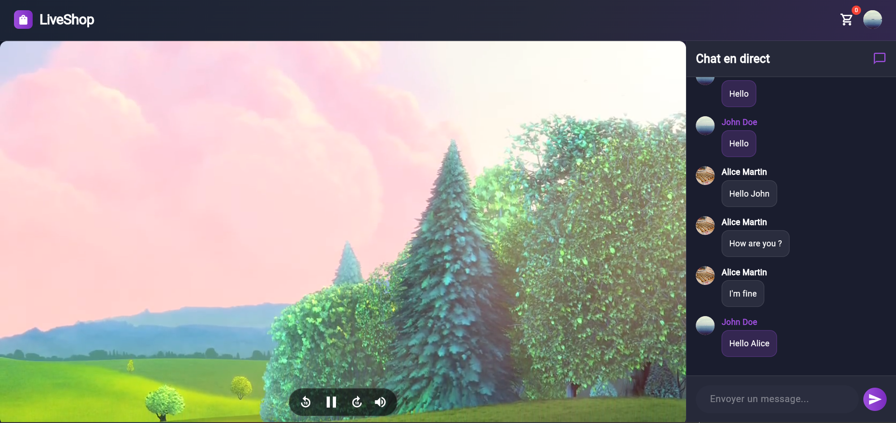
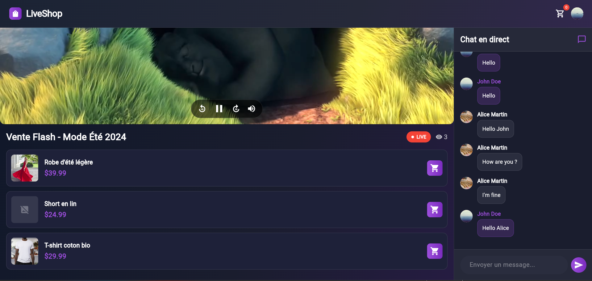
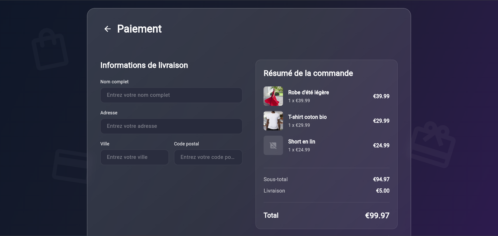

# LiveShop – Application de live shopping

## Aperçu
LiveShop est une application Flutter Web de live shopping mettant en avant une interface moderne et un flux en direct avec compteur de spectateurs en temps réel. Objectif ✅: permettre à un nouveau développeur de cloner, installer et lancer le projet en moins de 5 minutes.

## Screenshots










## Fonctionnalités implémentées
- ✅ Accueil: navigation claire, mises en avant de produits et accès aux lives.
- ✅ Authentification: écran de connexion (formulaire + feedback).
- ✅ Live Event: lecteur vidéo, liste de produits, chat (mocké), compteur de spectateurs (WebSocket/Socket.IO mock).
- ✅ Messagerie par live: échange de messages en temps réel sur chaque live.
- ✅ Panier: ajout/suppression d'articles, calcul du sous‑total.
- ✅ Checkout: résumé de commande, formulaire de livraison et paiement avec formatteurs (numéro carte `NNNN NNNN NNNN NNNN`, date `MM/YY`, Luhn).
- ✅ Profil: historique de commandes (mock), informations utilisateur.
- ✅ Tests unitaires: tests des modèles de données dans le dossier `test/`.
- 🚫 Backend réel: Le compteur de spectateurs utilise un serveur WebSocket/Socket.IO de démonstration.

## Configuration locale
1) Vérifier les prérequis
```bash
flutter --version      # Flutter installé (3.x recommandé)
dart --version         # Dart inclus avec Flutter
```

2) Installer les dépendances
```bash
flutter pub get
```

3) Utiliser le backend de démonstration fourni dans `backend/` (Python)
```bash
cd backend
python -m venv .venv
source .venv/Scripts/activate
pip install -r requirements.txt
python main.py   # lance le serveur Socket.IO
```

4) Démarrer l’application Web
```bash
flutter run -d chrome
```

## Architecture du projet
Arborescence simplifiée (mise à jour):
```
test_flutter/
├─ lib/                          # Code Flutter principal
│  ├─ main.dart                  # Bootstrap + routing
│  ├─ screens/                   # Écrans par fonctionnalité (feature folders)
│  │  ├─ home/                   # Accueil (+ components via `part`)
│  │  ├─ cart/                   # Panier (+ components)
│  │  ├─ checkout/               # Checkout (+ components, formateurs)
│  │  ├─ live_event/             # Live + top bar + chat + produits
│  │  ├─ login/                  # Connexion (+ components)
│  │  ├─ product/                # Détails produit
│  │  └─ profile/                # Profil + historique
│  ├─ blocs/                     # BLoC (Cart, Auth, LiveEvent, Orders, …)
│  ├─ services/                  # Services (ex: SocketIO, API clients)
│  ├─ config/                    # Configuration (ex: socket_configuration.dart)
│  ├─ models/                    # Modèles de données (product, order, user, ...)
│  ├─ shared_components/         # Widgets réutilisables (boutons, cards, décorations)
│  └─ utils/                     # Aides (ex: formatteurs de saisie)
├─ docs/                         # Captures + documents
│  ├─ screens/                   # Images pour README
│  ├─ MOCK_SERVICE_EXAMPLE.md    # Exemples de mock/services
│  └─ mock-api-data.json         # Données mock pour démos
├─ backend/                      # Backend Socket.IO de démonstration (Python)
├─ web/                          # Shell Web (index.html, manifest, icons)
├─ test/                         # Tests widget/unitaires
├─ analysis_options.yaml         # Règles d’analyse Dart
└─ pubspec.yaml                  # Dépendances et assets Flutter
```
Principes:
- Modularité par fonctionnalités (feature folders) pour la clarté et l’évolutivité.
- BLoC pour une gestion d’état prévisible et testable.
- UI réutilisable via `components/` et `part` pour des fichiers concis.
- Sécurité: validation des saisies (ex: Luhn), séparation claire front/back.

## Perspectives d’évolution
- [1] Paiement: intégration passerelle réelle (Stripe/Adyen).
- [2] Live avancé: chat temps réel avec modération et emojis.
- [3] Catalogue: filtres, recherche, recommandations.
- [4] Auth: social login (Google/Apple), reset mot de passe.
- [5] Observabilité: logs, métriques, monitoring (Sentry, Firebase Crashlytics).
- [6] CI/CD: pipeline build/test/deploy pour Web et mobile.
