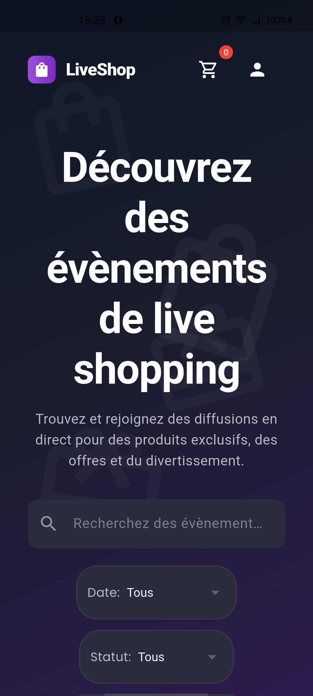
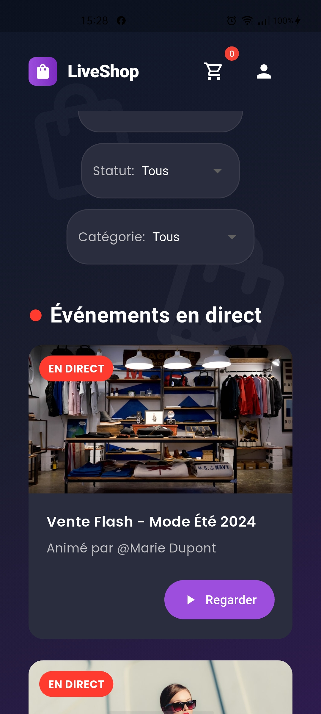
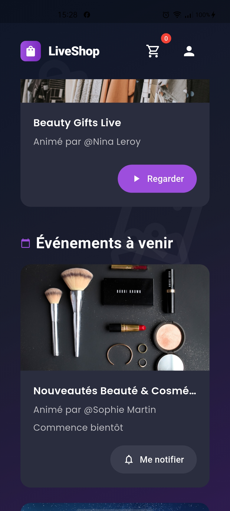
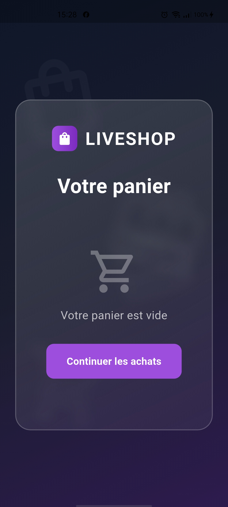
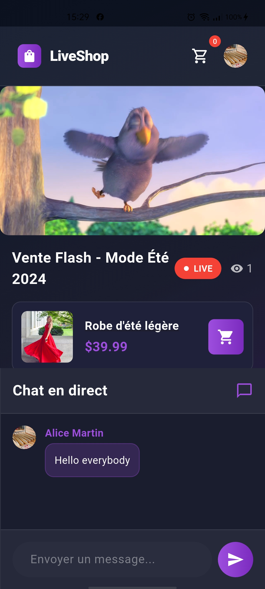
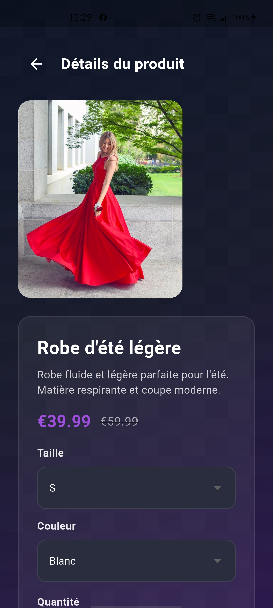
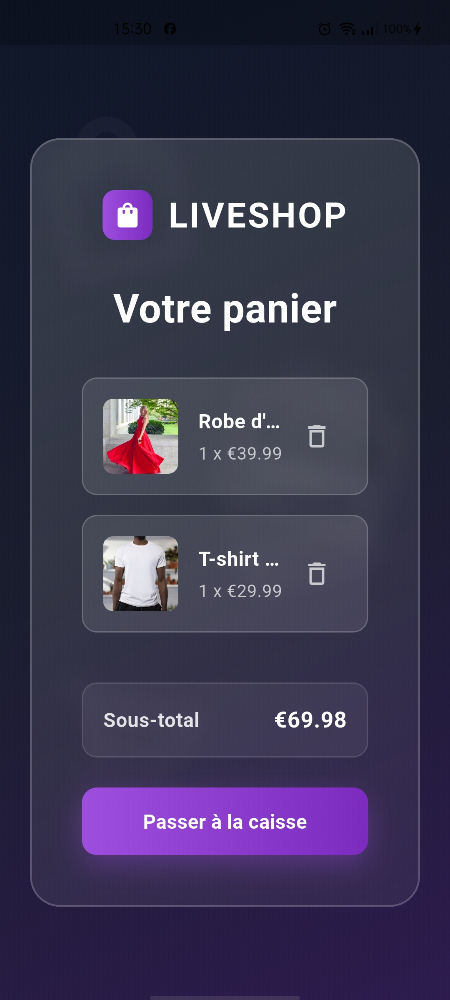
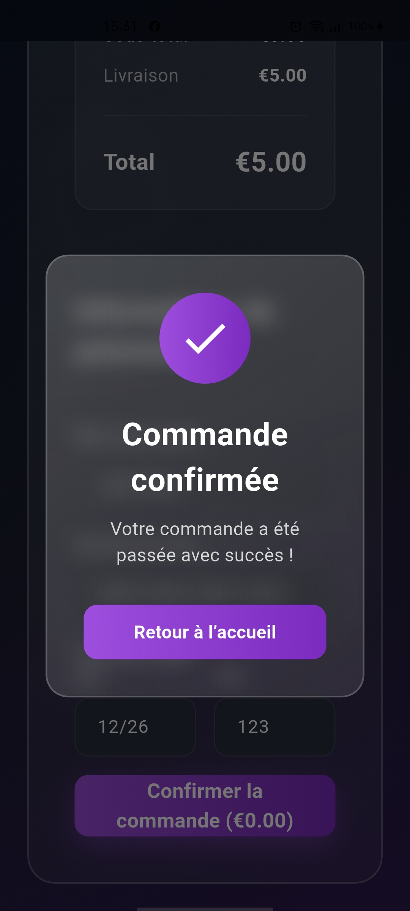

# LiveShop – Application de live shopping

## Aperçu
LiveShop est une application Flutter (Android & iOS) de live shopping mettant en avant une interface moderne et un flux en direct avec compteur de spectateurs en temps réel. Objectif ✅: permettre à un nouveau développeur de cloner, installer et lancer le projet en moins de 5 minutes. Vous pouvez consulter le vidéo démo ici : [voir vidéo](https://drive.google.com/file/d/1GDnNikMedHXtjoYJ1go06wgP4nSYidDn/view?usp=drive_link) et l'APK ici : [télécharger l'APK](https://drive.google.com/file/d/11ezQMzAnIlL7xItcFNTNSVFHvzQQB_Hg/view?usp=drive_link).

## Screenshots














## Fonctionnalités implémentées
- ✅ Accueil: navigation claire, mises en avant de produits et accès aux lives.
- ✅ Authentification: écran de connexion (formulaire + feedback).
- ✅ Live Event: lecteur vidéo, liste de produits, chat simulé avec BLoC et streams.
- ✅ Messagerie par live: échange de messages simulés en temps réel via state management (BLoC).
- ✅ Panier: ajout/suppression d'articles, calcul du sous‑total.
- ✅ Checkout: résumé de commande, formulaire de livraison et paiement avec formatteurs (numéro carte `NNNN NNNN NNNN NNNN`, date `MM/YY`, Luhn).
- ✅ Profil: historique de commandes (mock), informations utilisateur.
- ✅ Tests unitaires: tests des modèles de données dans le dossier `test/`.
- 🚫 Backend réel: Le chat et le compteur de spectateurs sont simulés côté client avec BLoC et streams.

## Configuration locale
1) Vérifier les prérequis
```bash
flutter --version      # Flutter installé (3.x recommandé)
dart --version         # Dart inclus avec Flutter
```

2) Installer les dépendances
```bash
flutter pub get
```

3) Démarrer l'application
```bash
# Pour Android
flutter run

# Pour iOS
flutter run

# Pour le Web (optionnel)
flutter run -d chrome
```

## Architecture du projet

```
app/
├─ lib/                          # Code Flutter principal
│  ├─ main.dart                  # Bootstrap + routing
│  ├─ screens/                   # Écrans par fonctionnalité (feature folders)
│  │  ├─ home/                   # Accueil (+ components via `part`)
│  │  ├─ cart/                   # Panier (+ components)
│  │  ├─ checkout/               # Checkout (+ components, formateurs)
│  │  ├─ live_event/             # Live + top bar + chat + produits
│  │  ├─ login/                  # Connexion (+ components)
│  │  ├─ product/                # Détails produit
│  │  └─ profile/                # Profil + historique
│  ├─ blocs/                     # BLoC (Cart, Auth, LiveEvent, Orders, Chat…)
│  ├─ services/                  # Services mock pour données (API clients simulés)
│  ├─ config/                    # Configuration de l'application
│  ├─ models/                    # Modèles de données (product, order, user, chat_message...)
│  ├─ shared_components/         # Widgets réutilisables (boutons, cards, décorations)
│  └─ utils/                     # Aides (ex: formatteurs de saisie)
├─ docs/                         # Captures + documents
│  ├─ MOCK_SERVICE_EXAMPLE.md    # Exemples de mock/services
│  └─ mock-api-data.json         # Données mock pour démos
├─ screenshots/                  # Captures d'écran de l'application
├─ web/                          # Ressources Web (index.html, manifest, icons)
├─ android/                      # Configuration Android
├─ ios/                          # Configuration iOS
├─ test/                         # Tests widget/unitaires
├─ analysis_options.yaml         # Règles d'analyse Dart
└─ pubspec.yaml                  # Dépendances et assets Flutter
```
Principes:
- Modularité par fonctionnalités (feature folders) pour la clarté et l'évolutivité.
- BLoC pour une gestion d'état prévisible et testable (chat simulé via streams).
- UI réutilisable via `components/` et `part` pour des fichiers concis.
- Sécurité: validation des saisies (ex: Luhn), mock de données côté client.

## Perspectives d'évolution
- [1] Backend réel: intégration WebSocket/Socket.IO pour chat et compteur de spectateurs en temps réel.
- [2] Paiement: intégration passerelle réelle (Stripe/Adyen).
- [3] Live avancé: chat temps réel avec modération et emojis.
- [4] Catalogue: recommandations.
- [5] Auth: social login (Google/Apple), reset mot de passe.
- [6] Observabilité: logs, métriques, monitoring (Sentry, Firebase Crashlytics).
- [7] CI/CD: pipeline build/test/deploy pour Android, iOS et Web.
